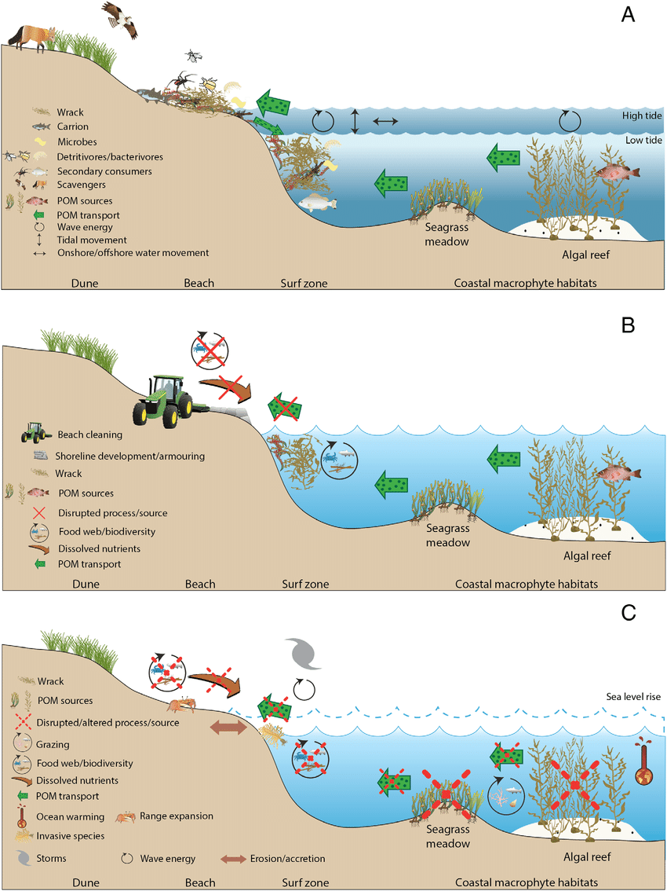

**Welcome to my final project**

Sandy beaches are an essential and beautiful part of our coastline, but they are a woefully misunderstood ecological niche. The common conception is that beaches are lifeless expanses of sand fit for beach days and relaxation only. But there is a wide variety of cross boundary interactions happening over the beach, connecting the ocean and the land together in a dense web of nutrient exchange and interaction. 
<figure>
  
  <figcaption style="font-size:12px; color:grey; text-align:center; margin-top:8px; margin-bottom:25px;">
    Hyndes, Glenn & Berdan, Emma & Duarte, Cristian & Dugan, Jenifer & Emery, Kyle & Hambäck, Peter & 
    Henderson, Christopher & Hubbard, David & Lastra, Mariano & Mateo, Miguel & Olds, Andrew & Schlacher, Thomas. (2022). 
    <em>The role of inputs of marine wrack and carrion in sandy-beach ecosystems: a global review</em>. 
    Biological Reviews of the Cambridge Philosophical Society. 97. 10.1111/brv.12886.
  </figcaption>
</figure>

During my previous work as a lab technician in Kyle Cavanaugh's coastal Geography lab here at UCLA, I worked in the field to survey 12 distinct sand beach sites along the coast doing vegetation surveys, RTK profiles of beach height, and drone surveys which I processed into high resolution maps of vegetation cover and digital elevation models to study the morphodynamics of dune ecosystems. 

I have continued to expand on this work for my masters thesis, where I am developing a framework to study beach erosion dynamics using high resolution satellite imagery. For my final project today, I am presenting a crucial step in analysing the beach width data I have created by connecting the observed beach width dynamics with climatic variables to understand how storm events influence the width of beaches. For this project, I have used KMeans clustering to parse raw weather data connected from around my first site at Samoa State Beach in Humboldt County, California. I use unsupervised clustering to separate out storm days among the hourly climatic data collected, and have developed a robust framework which will allow me to pull storm dates reliably from across California. 

My report outlining the methodology of how I gathered raw weather data from local stations, cleaned the various data sources, and deployed my KMeans clustering algorithm to find storm dates in my time series is linked [here](/assets/FinalReport_MC.pdf) with its associated [code](/assets/StormClustering.py)

